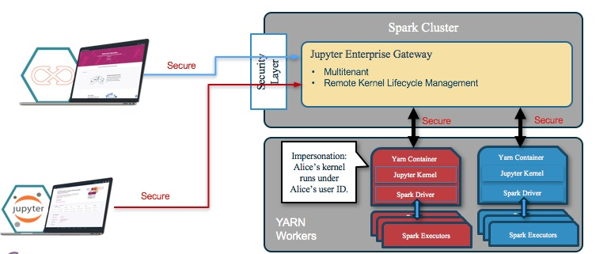

# Proposal for Incubation

## Subproject name

Jupyter Enterprise Gateway ('jupyter-incubator/enterprise_gateway')

## Development team and Advocate

* Luciano Resende, IBM ('@lresende')
* Kevin Bates, IBM ('@kevin-bates')
* Christian Kadner, IBM ('@ckadner')
* Kun Liu, IBM ('@liukun1016')
* Alan Chin, IBM ('@akchinSTC')
* Sherry Guo, IBM ('@sherryxg')
* Fred Reiss, IBM ('@frreiss')
* Sanjay Saxena ('@sanjay-saxena')

Who is the Steering Council Advocate for this Subproject?

* Kyle Kelley ('@rgbkrk')
* Peter Parente ('@parente')

## Subproject goals, scope and functionality

### Problem
Founded in academia, the Jupyter projects provide a rich and highly popular set of applications for
interacting with and iterating on large and complex applications.  It has been truly ground-breaking.
However, when we first attempted to build a Notebook service that could enable a large number of data
scientists to run frequent and large workloads against a large Apache Spark cluster, we identified
several requirements that were not currently available in the Jupyter open source ecosystem. We tried
to use the Jupyter Kernel Gateway project, but we quickly realized that the JKG server became the
bottleneck because the co-located Spark driver application for these kinds of workloads (in this case,
the kernel process running on behalf of notebook cells) were extremely resource intensive. Toss in a team
or organization of data scientists, and you quickly saturate the compute resources of the Kernel Gateway
server.

### Goals
The primary goal behind Jupyter Enterprise Gateway is to address the gaps identified during our experience
described above and provide a lightweight, multi-tenant gateway that enables many notebook users to share
a single Spark Cluster and run kernels as managed resources within the cluster (i.e. Yarn Cluster mode).
By providing tight integration with the resource manager used by the Spark cluster, we avoid resource starvation
caused by multiple processes that are unaware of each other and compete for the same resources.  We can also provide
complex scheduling capabilities such as [capacity scheduling and priority queues](https://hadoop.apache.org/docs/r2.7.4/hadoop-yarn/hadoop-yarn-site/CapacityScheduler.html)
with a very low development cost, thus satisfying Enterprise Administrators manageability and security
requirements. Although the Apache Yarn resource manager is immediately supported, we have plans to support
others such as Spark on Kubernetes in the near future utilizing the existing resource manager pluggable framework.

We strive to not alter any kernel code itself.  As a result, we've developed kernel launchers that essentially
house the target kernel and serve as life-cycle managers for functionality like interrupt or, in some cases,
kernel termination.

### Scope
In general, Enterprise Gateway is intended to the address the needs of enterprise and cloud administrators
such that cluster resource utilization is optimized across all applications, including those of data scientists
performing analysis via Notebooks residing on their desktops.

### Use Cases

*As a data scientist, I want to attach a local Jupyter Notebook server to the enterprise/cloud shared compute cluster
to run compute-intensive analytical workload (e.g. multi-tenant interactive gateway to Apache Spark cluster).

* As an Spark Cluster administrator, I want to enable notebook users to utilize all the computing resources available
in the enterprise/cloud compute cluster to run analytical workloads in a managed and secure way.

* As an administrator, I want enforce user isolation such that notebook kernel processes are protected against each
other allowing users to preserve and leverage their own environment, i.e. libraries and/or packages, data, etc.

## Audience

Platform Engineers and Apache Spark Administrators that want to enable Data Scientists and other Jupyter
Notebook users to connect and share existing Spark cluster resources when executing their notebooks.

## Other options

We are not aware of alternatives that provide the same set of capabilities, the closest that we could find
is JupyterHub, but that aims to spawn multiple Jupyter Notebook servers around a given cluster - where the
kernel processes are still co-located with the launching server.

## Integration with Project Jupyter

Enterprise Gateway is based on the Jupyter Notebook stack, and directly extends Kernel Gateway, Notebook Server,
and Jupyter Client. These components, including it's transient dependencies to other projects are all used and
required by Jupyter Enterprise Gateway.
